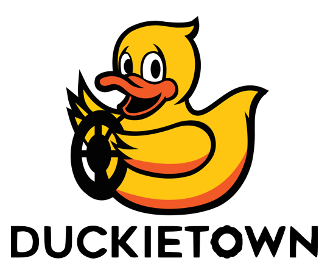

#  Real-time object detection: Project report {#real-time-object-detection-final-report status=ready}
<!--
This is where I write the overview/the first page presentation
-->
<figure class="flow-subfigures">
    <figure>
        
    </figure>
    <figure>
        
    </figure>
</figure>

## The final result {#real-time-object-detection-final-result}

Let's start from a teaser.

* Post a video of your best results (e.g., your demo video): remember to have duckies on the robots or something terrible might happen!

You might want to add as a caption a link to your [instructions to reproduce](#instructions-real-time-object-detection) to reproduce these results.
Moreover, add a link to the readme.txt of your code.

## Mission, Scope and motivation {#real-time-object-detection-final-scope}
Perception is a key component for any autonomous system. State-of-the-art autonomous driving technologies have object detection as part of their perception method.
Unfortunately, benefits of object detection were never fully leveraged for Duckietown as this method runs into one big obstacle: real-time performance. Real time performance is crucial for robotics and as object detection is quite computationally expensive, its performance on the duckiebot is limited.
The goal of this project is to propose a method for real-time object detection and tracking that can be run on a duckiebot with acceptable performance using a Jetson Nano.

### Existing solution {#real-time-object-detection-final-literature}

For this work, and with this difficult context, we were not able to built our own dataset to train ou different models. 
Fortunatly, a [previous project](https://docs.duckietown.org/daffy/AIDO/out/object_detection_dataset.html "Object Detection Dataset") built a whole dataset for to implement object detection in Duckietown.
We also found [this project](https://github.com/duckietown/duckietown-objdet  "Project TBD") that aimed at implementing a object detector in DuckieTown. Unfortunately, this project seems to be deprecated so we did not use it.
Finally, we used the exercise 3 structure to implement our final object detector.
### Opportunity {#real-time-object-detection-final-opportunity}

As stated before, no object detectors were implemented in the DuckieTown pipeline for one good reason : it could not run on the Raspberry Pi in real time.
This year, we were lucky to also have a Jetson Nano that have a more powerful GPU. We therefore decided to try and implement a object detector that :
- run faster with Tracking while maintaining a good accuracy,
- can run on the Jetson Nano at reasonnable speed.

To do this, we compared and used different objection detection methods to find out which offers the best compromise between performance and accuracy in the DuckieTown setting.
To increase the speed of the object detection, we also used tracking between two object detections.
With the final OD real-time pipeline, we tried to implement a way to avoid detected obstacles.

## Background and Preliminaries {#real-time-object-detection-final-preliminaries}
In this report a few preliminary knowledge is needed. 
<!--
We will talk about Neural Networks (NN) and their performance. 
A NN performance is measure in FLOPs, which stands for **FL**oating **P**oint **O**perations. 
-->

The main mathematical difficulty that the reader can encounter is the Kalman Filter.
Kalman filter is used in this project in the Tracking step. 
The main idea of the Kalman filter is that, given a model of evolution of our state, its noise model and the measurement and noise measrueement model of our system, we can firstly predict the next step state then, with our measurement corresponding to this new step, we can update to take into account both the dynamic model and the measurement.
A full lecture was given by Dr. Forbes on this subject [there](https://liampaull.ca/ift6757/assets/pres.pdf "Kalman Filter lecture").

*MAYBE EXPLAIN HUNGARIAN ALGORITHM TOO ?*

On another subject, the two neural networks that are presented are compared have two very different architectures. 
Indeed, there are mainly two types of object detectors. On the one hand, we have the one-stage object detectors, such a Yolo or SSD-MobileNet, which use *TO COMPLETE*. On the other hand, the two stages object detectors *TO COMPLETE*, such as FasterRCNN or MaskRCNN.
One stage ODs tend to have faster inference time while two stages ODs tend to have higher mean average precision. 
[This article](https://www.ecva.net/papers/eccv_2020/papers_ECCV/papers/123590528.pdf "MimicDet") explains quite thoroughly the differences and similarities between the two architectures.

## Definition of the problem {#real-time-object-detection-final-problem-def}

_Up to now it was all fun and giggles. This is the most important part of your report: a crisp, possibly mathematical, definition of the problem you tackled. You can use part of the preliminary design document to fill this section._

Make sure you include your:
- final objective / goal
- assumptions made
- quantitative performance metrics to judge the achievement of the goal

## Contribution / Added functionality {#real-time-object-detection-final-contribution}

Describe here, in technical detail, what you have done. Make sure you include:
- a theoretical description of the algorithm(s) you implemented
- logical architecture
- software architecture
- details on the actual implementation where relevant (how does the implementation differ from the theory?)
- any infrastructure you had to develop in order to implement your algorithm
- If you have collected a number of logs, add link to where you stored them

_Feel free to create subsections when useful to ease the flow_

## Formal performance evaluation / Results {#real-time-object-detection-final-formal}

_Be rigorous!_

- For each of the tasks you defined in you problem formulation, provide quantitative results (i.e., the evaluation of the previously introduced performance metrics)
- Compare your results to the success targets. Explain successes or failures.
- Compare your results to the "state of the art" / previous implementation where relevant. Explain failure / success.
- Include an explanation / discussion of the results. Where things (as / better than / worst than) you expected? What were the biggest challenges?

## Future avenues of development {#real-time-object-detection-final-next-steps}

_Is there something you think still needs to be done or could be improved? List it here, and be specific!_
