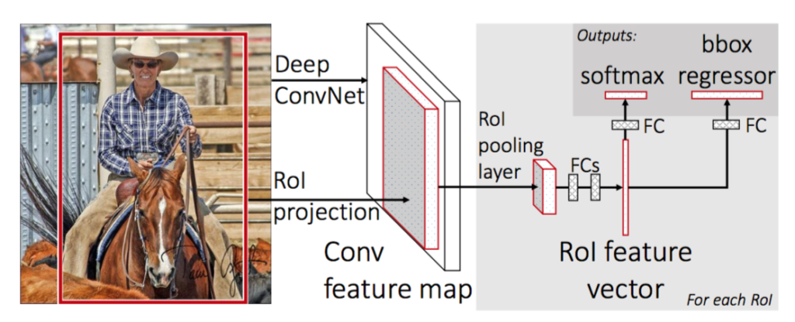
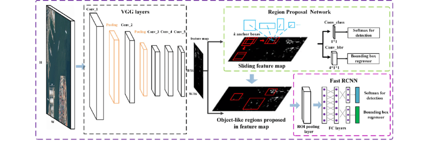
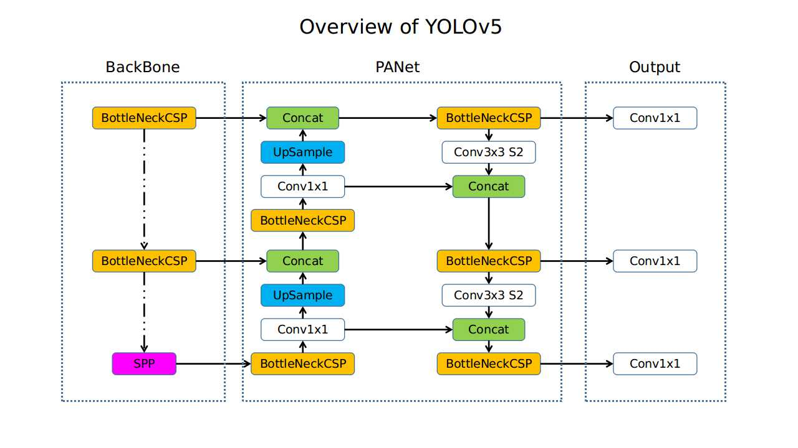
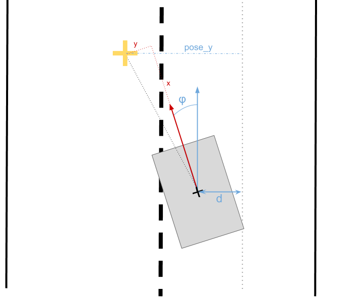
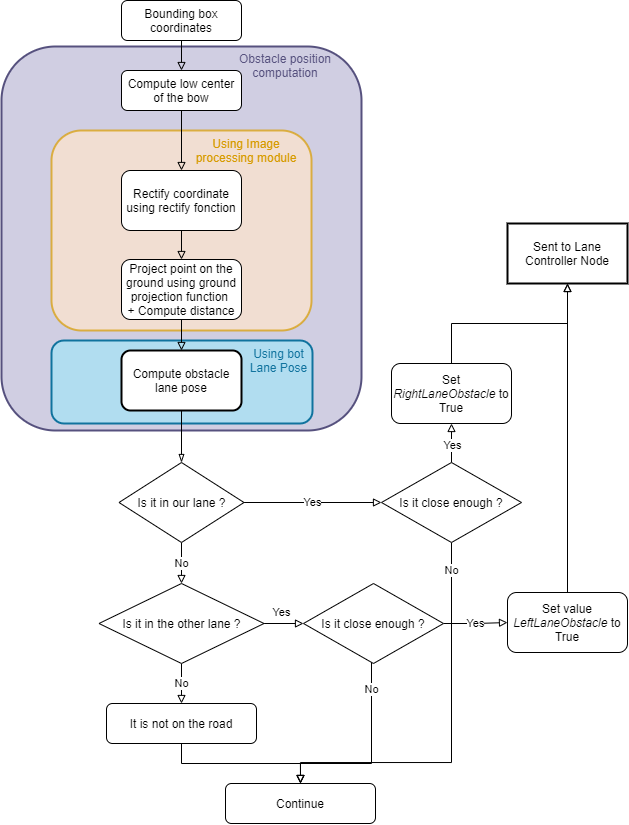
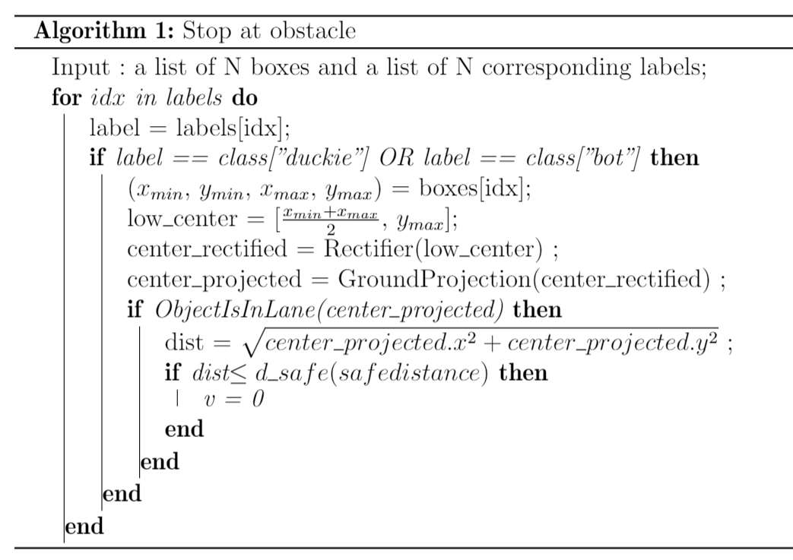
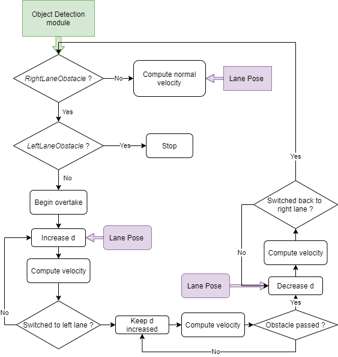
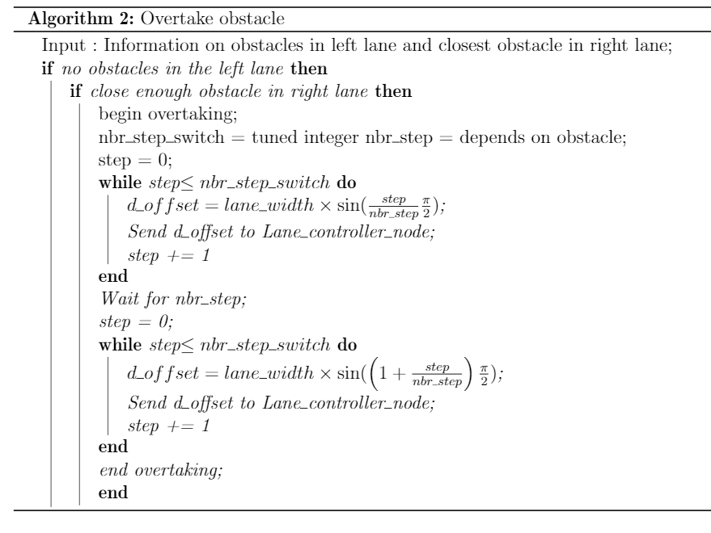

#  Real-time object detection: Project report {#real-time-object-detection-final-report status=ready}
<!--
This is where I write the overview/the first page presentation

<figure class="flow-subfigures">
    <figure>
        
    </figure>
    <figure>
        
    </figure>
</figure>
-->

   

Authors :

Dishank BANSAL

Bhavya PATWA

Sophie CHAUDONNERET

## The final result {#real-time-object-detection-final-result}

Let's start from a teaser.

* Post a video of your best results (e.g., your demo video): remember to have duckies on the robots or something terrible might happen!

You might want to add as a caption a link to your [instructions to reproduce](#instructions-real-time-object-detection) to reproduce these results.
Moreover, add a link to the readme.txt of your code.

## Mission, Scope and motivation {#real-time-object-detection-final-scope}
Perception is a key component for any autonomous system. State-of-the-art autonomous driving technologies have object detection as part of their perception method.
Unfortunately, benefits of object detection were never fully leveraged for Duckietown as this method runs into one big obstacle: real-time performance. Real time performance is crucial for robotics and as object detection is quite computationally expensive, its performance on the duckiebot is limited.
The goal of this project is to propose a method for real-time object detection and tracking that can be run on a duckiebot with acceptable performance using a Jetson Nano.

### Existing solution {#real-time-object-detection-final-literature}

For this work, and with this difficult context, we were not able to build our own dataset to train our different models. 
Fortunately, a [previous project](https://docs.duckietown.org/daffy/AIDO/out/object_detection_dataset.html "Object Detection Dataset") built a whole dataset for to implement object detection in Duckietown.
We also found [this project](https://github.com/duckietown/duckietown-objdet  "Project TBD") that aimed at implementing an object detector in DuckieTown. Unfortunately, this project seems to be deprecated, so we did not use it.
Finally, we used the exercise 3 structure to implement our final object detector.

### Opportunity {#real-time-object-detection-final-opportunity}

As stated before, no object detectors were implemented in the DuckieTown pipeline for one good reason : it could not run on the Raspberry Pi in real time.
This year, we were lucky to also have a Jetson Nano that has a more powerful GPU. We therefore decided to try and implement an object detector that :
- run faster with Tracking while maintaining a good accuracy,
- can run on the Jetson Nano at reasonable speed.

To do this, we compared and used different objection detection methods to find out which offers the best compromise between performance and accuracy in the DuckieTown setting.
To increase the speed of the object detection, we also used tracking between two object detections.
With the final OD real-time pipeline, we tried to implement a way to avoid detected obstacles.

## Background and Preliminaries {#real-time-object-detection-final-preliminaries}
In this report a few preliminary knowledge is needed. 
<!--
We will talk about Neural Networks (NN) and their performance. 
A NN performance is measure in FLOPs, which stands for **FL**oating **P**oint **O**perations. 
-->

The main mathematical difficulty that the reader can encounter is the Kalman Filter.
Kalman filter is used in this project in the Tracking step. 
The main idea of the Kalman filter is that, given a model of evolution of our state, its noise model and the measurement and noise measurement model of our system, we can firstly predict the next step state then, with our measurement corresponding to this new step, we can update to take into account both the dynamic model and the measurement.
A full lecture was given by Dr. Forbes on this subject [there](https://liampaull.ca/ift6757/assets/pres.pdf "Kalman Filter lecture").

On another subject, the two neural networks that are presented are compared have two very different architectures. 
Indeed, there are mainly two types of object detectors. On the one hand, we have the one-stage object detectors, such a Yolo or SSD-MobileNet, which make a fixed number of predictions on grid. On the other hand, the two stages object detectors use a proposal network to find approximately objects and then use a second network to fine-tune these detections and give final predictions, such as FasterRCNN or MaskRCNN.
One stage ODs tend to have faster inference time while two stages ODs tend to have higher mean average precision. 
[This article](https://www.ecva.net/papers/eccv_2020/papers_ECCV/papers/123590528.pdf "MimicDet") explains quite thoroughly the differences and similarities between the two architectures. 

## Object detection models : FasterRCNN vs. YOLOv5 {#real-time-object-detection-final-first-section}
### FasterRCNN architecture and performance

As mentioned above, FasterRCNN is a two stage detector. The first stage is called the RPN (**R**egion **P**roposal **N**etwork), it processes the images by a feature extractor and keep only the topmost feature maps to to predict bounding box proposals. The second stage then crop features from the topmost feature maps using these bounding box proposals. The cropped features are then passed on to the FastRCNN for bounding box regression and classification.

As its name suggests, FastRCNN is a faster version of R-CNN. Its architecture is presented in figure 3.1.

In figure 3,2, you can see the 2 stages mentioned above and the FastRCNN module.
<figure>
    <figcaption>Fast-RCNN architecture (source : https://arxiv.org/abs/1504.08083)</figcaption>
    
</figure>

<figure>
    <figcaption>Faster-RCNN architecture (source : https://www.researchgate.net/figure/The-architecture-of-Faster-R-CNN_fig2_324903264)</figcaption>
    
</figure>

### Yolo architecture and performance
YOLOv5 is a one stage object detector, like any one stage detector, it is made of three main parts :

- model backbone
- model neck
- model head

The model backbone is used in object detection to extract the most important features : the richest and most distinctive ones. In YOLOv5, the backbone used is [CSPNet](https://github.com/WongKinYiu/CrossStagePartialNetworks "CSPNet repo") which stands for **C**ross **S**tage **P**artial **Net**works. 

Model neck is used in object detectors to build feature pyramids in order to detect an object of different sizes and scales. There are many different feature pyramid techniques available. YOLOv5 uses [PANet](https://arxiv.org/abs/1803.01534 "PANet article"), which stands for **P**ath **A**ggregation **Net**work.

The YOLOv5 model head is the same as in the previous version of Yolo.

Figure 3.3 gives an overall representation of YOLOv5 architecture. 

<figure>
    <figcaption>YOLOv5 architecture (source : https://github.com/ultralytics)</figcaption>
    
</figure>

## Tracking  {#real-time-object-detection-final-second-section}

### Motivation
Now that we have found the detector that provides the best compromise between performance and accuracy, we wanted to be able to speed up the detection process by tracking the detected bounding boxes between two detections in order to be able to skip frames in our object detector.

Moreover, Tracking can help to recover dropped detection for in-between frames.

### Kalman filter
To track a bounding over frames, we will be working in pixel space. 
For tracking, we assume here that the bounding boxes moves at constant speed in pixel space.
<!--
This assumption is realistic as most of the object detected will be static (duckies, cones, bus, etc...) except for the duckiebots that have only limited acceleration when driving.
-->
We will use a Kalman filter to track our bounding boxes. 
Let $\mathrm{X_k}$ be the state vector that represents the bounding boxe coordinates and their velocities. 

\begin{equation}
\mathrm{X_k} = [x_1, y_1, x_2, y_2, v_{x,1}, v_{y,1}, v_{x,2}, v_{x,2}]
\end{equation}

The motion model of the system that will be used for prediction is quite simple (as velocity is assumed constant): 

\begin{equation}
\mathrm{F}=\left[\begin{array}{cccccccc}
1 & 0 & 0 & 0 & d t & 0 & 0 & 0 \\
0 & 1 & 0 & 0 & 0 & d t & 0 & 0 \\
0 & 0 & 1 & 0 & 0 & 0 & d t & 0 \\
0 & 0 & 0 & 1 & 0 & 0 & 0 & d t \\
0 & 0 & 0 & 0 & 1 & 0 & 0 & 0 \\
0 & 0 & 0 & 0 & 0 & 1 & 0 & 0 \\
0 & 0 & 0 & 0 & 0 & 0 & 1 & 0 \\
0 & 0 & 0 & 0 & 0 & 0 & 0 & 1
\end{array}\right]
\end{equation}

The bounding box detection by object detector is used as measurement in the update step. The measurement is the bounding box coordinates :

\begin{equation}
\mathrm{z_k} = [x_1, y_1, x_2, y_2]
\end{equation}

The measurement model of the system is then :

\begin{equation}
\mathrm{H}=\left[\begin{array}{cccccccc}
1 & 0 & 0 & 0 & 0 & 0 & 0 & 0 \\
0 & 1 & 0 & 0 & 0 & 0 & 0 & 0 \\
0 & 0 & 1 & 0 & 0 & 0 & 0 & 0 \\
0 & 0 & 0 & 1 & 0 & 0 & 0 & 0
\end{array}\right]
\end{equation}

The final Kalman filter equations for bounding box tracking is :

- Prediction step :

\begin{equation}
\begin{aligned}
\hat{\mathbf{x}}_{k}^{\prime} &=\mathbf{F} \hat{\mathbf{x}}_{k-1} \\
\mathbf{P}_{k}^{\prime} &=\mathbf{F} \mathbf{P}_{k-1}^{\prime} \mathbf{F}^{T}+\mathbf{Q}
\end{aligned}
\end{equation}

- Update step :

\begin{equation}
\begin{aligned}
\hat{\mathbf{x}}_{k} &=\hat{\mathbf{x}}_{k}^{\prime}+\mathbf{K}_{k}\left(\mathbf{z}_{k}-\mathbf{H} \hat{\mathbf{x}}_{k}^{\prime}\right) \\
\mathbf{P}_{k} &=\left(\mathbf{I}-\mathbf{K}_{k} \mathbf{H}\right) \mathbf{P}_{k}^{\prime} \\
\mathbf{K}_{k} &=\mathbf{P}_{k}^{\prime} \mathbf{H}^{T}\left(\mathbf{H} \mathbf{P}_{k}^{\prime} \mathbf{H}^{T}+\mathbf{R}_{\mathbf{k}}\right)^{-1}
\end{aligned}
\end{equation}

### Hungarian filter

In the previous section, we only talk about one bounding box that we track through frames. 

In reality it is more complex : when there are multiple detections (i.e multiple bounding boxes), how to know which observation associate with which prediction at the update step ?

A solution is to use the *Hungarian algorithm* for Data association. 

Let there be *N* predicted bounding boxes and *M* observations (detected bounding boxes). The Hungarian Algorithm will match the *N* boxes to *N* observations among the *M* possible so that the solution is optimal over a given metric. Here, the metric used is **IoU**, which stands for **I**ntersection **o**ver **U**nion. It is computed using this formula :

\begin{equation}
IoU = \frac{Area\; of \; Overlap}{Area\; of \; Union}
\end{equation}

## Object avoidance
In this section, we will see how we can use the duckiebot and duckie detector to implement certain behaviours in order to make DuckieTown safe again.
We had two main goal behaviours :

- Stopping in front of an obstacle
- Overtaking an obstacle

### Compute obstacle position in lane
First of all, we need to know, from the bounding boxes detected by our detector, the position of the obstacles.
This position will be used to pass two information to the lane controller : 

- Is there an obstacle close enough in our lane ?
- Is there a close obstacle in the other (left) lane ?

Let's take a bounding box. The coordinate of this box is given in pixels in the distorted image (due to the camera lens). First, we need to compute the center of the obstacle on the ground. Then, we need to rectify the center coordinates so that it corresponds to the rectified image. Since the point is considered on the ground (low edge of the box), we can use the GroundProjection module (used for line detection) to estimate the real coordinates from the duckiebot's origin.
Then, with the duckiebot's lane pose, we can compute the obstacle lane pose using this formula :
\begin{equation}
    pose_y = \cos(\phi) (y + d) + \sin(\phi) x
\end{equation}

A diagram given in figure 3.4 illustrates the situation, the grey rectangle being the duckiebot and the yellow cross an obstacle.
<figure>
    <figcaption>Obstacle position diagram</figcaption>
    
</figure>

In the figure 3.5, the flowchart to make the decision is detailed.

<figure>
    <figcaption>Obstacle position flowchart</figcaption>
    
</figure>

### Stopping in front of an obstacle
The first behaviour is quite straight forward : if an obstacle (duckiebot of duckie) is detected in our lane close enough from the bot, the lane controller passes $v = 0$ to the wheel command. 
Figure 3.6 details the algorithm used to stop in front of an obstacle.

<figure>
    <figcaption>Algorithm to stop in front of an obstacle</figcaption>
    
</figure>

### Overtaking an obstacle
Here the problem is more challenging : avoiding an obstacle. 
In the literature, obstacle avoidance is well researched and most of the solutions proposed use graphs in which the vehicle must find the shortest path while respecting constraints or path planning. 

In DuckieTown, we thought it would be simpler to overtake the obstacle by switching lane. 

Our solution is to change the d_off parameter used in the Lane Controller Node to make the duckiebot believe it is not in the right lane. 

First, we need to increase the d_off parameter so that the bot moves to the left lane, then keep it increased while it passes the obstacle and finally decrease it to switch back to the right lane.

The decision process to know when to overtake is detailed in figure 3.5. In figure 3.7, the flowchart to overtake the obstacle is explained. The corresponding algorithm is also detailed in figure 3.8.

<figure>
    <figcaption>Obstacle overtaking flowchart</figcaption>
    
</figure>

<figure>
    <figcaption>Algorithm to overtake an obstacle</figcaption>
    
</figure>

<!--
## Definition of the problem {#real-time-object-detection-final-problem-def}

_Up to now it was all fun and giggles. This is the most important part of your report: a crisp, possibly mathematical, definition of the problem you tackled. You can use part of the preliminary design document to fill this section._

Make sure you include your:
- final objective / goal
- assumptions made
- quantitative performance metrics to judge the achievement of the goal

## Contribution / Added functionality {#real-time-object-detection-final-contribution}

Describe here, in technical detail, what you have done. Make sure you include:
- a theoretical description of the algorithm(s) you implemented
- logical architecture
- software architecture
- details on the actual implementation where relevant (how does the implementation differ from the theory?)
- any infrastructure you had to develop in order to implement your algorithm
- If you have collected a number of logs, add link to where you stored them

_Feel free to create subsections when useful to ease the flow_

-->

## Formal performance evaluation / Results {#real-time-object-detection-final-formal}

We compared the different detectors using different processors to assess which will perform best on the duckiebot.

Here are some specifications regarding the material used to obtain the metrics provided above :

- CPU : AMD Ryzen Threadripper 1950X 16-Core Processor
- GPU : GeForce RTX 2080 Ti, 11 GB
- RAM : 32 GB
- Jetson Nano : specifications cqn be found [here](https://developer.nvidia.com/embedded/jetson-nano 'Jetson Nano specs')

The metrics used to assess the object detector's performance are **FPS** (**F**rames **P**er **S**econd) and **mAP** (**m**ean **A**verage **P**recision). The first one measures the detector's speed and the second one its accuracy.

We would like to remind the reader here that the following numbers are **without Tracking** and that FPS can be easily **doubled** if we skip every other image.

Here is the performance of **FasterRCNN** with two different backbones : _Resnet50_ and _Resnet18_. Both were tested using the DuckieTown gym mentioned [above]{#real-time-object-detection-final-literature}.

- Using the **Resnet50** backbone :

<col4 figure-id="tab:Resnet50 backbone" class="labels-row1">
    Proposals
    FPS (on GPU)
    FPS (on CPU)
    mAP
    300
    55.5 (0.018s)
    1.8 (0.55s)
    83.9%
    50
    77 (0.013s)
    2.6 (0.38s)
    83.8%
    10
    77 (0.013s)
    2.7 (0.36s)
    74.3%
</col4>

- Using **Resnet18** :

<col4 figure-id="tab:Resnet18 backbone" class="labels-row1">
    Proposals
    FPS (on GPU)
    FPS (on CPU)
    mAP
    300
    111 (0.009s)
    5.55 (0.18s)
    86.472%
    50
    142 (0.007s)
    7.69 (0.13s)
    86.462%
</col4>

YOLOv5 has been tested on high and low-resolution images.

<col5 figure-id="tab:YOLOv5" class="labels-row1">
    Resolution
    FPS (on GPU)
    FPS (on CPU)
    FPS (on Jetson Nano)
    mAP
    640x480
    110 (0.009s)
    9.6 (0.104s)
    5 (0.200s)
    71.14%
    320x240
    113 (0.009s)
    19.5 (0.051s)
    10 (0.100s)
    68.56%
</col5>

<!--
_Be rigorous!_

- For each of the tasks you defined in you problem formulation, provide quantitative results (i.e., the evaluation of the previously introduced performance metrics)
- Compare your results to the success targets. Explain successes or failures.
- Compare your results to the "state of the art" / previous implementation where relevant. Explain failure / success.
- Include an explanation / discussion of the results. Where things (as / better than / worst than) you expected? What were the biggest challenges?
-->

## Future avenues of development {#real-time-object-detection-final-next-steps}

_Is there something you think still needs to be done or could be improved? List it here, and be specific!_
